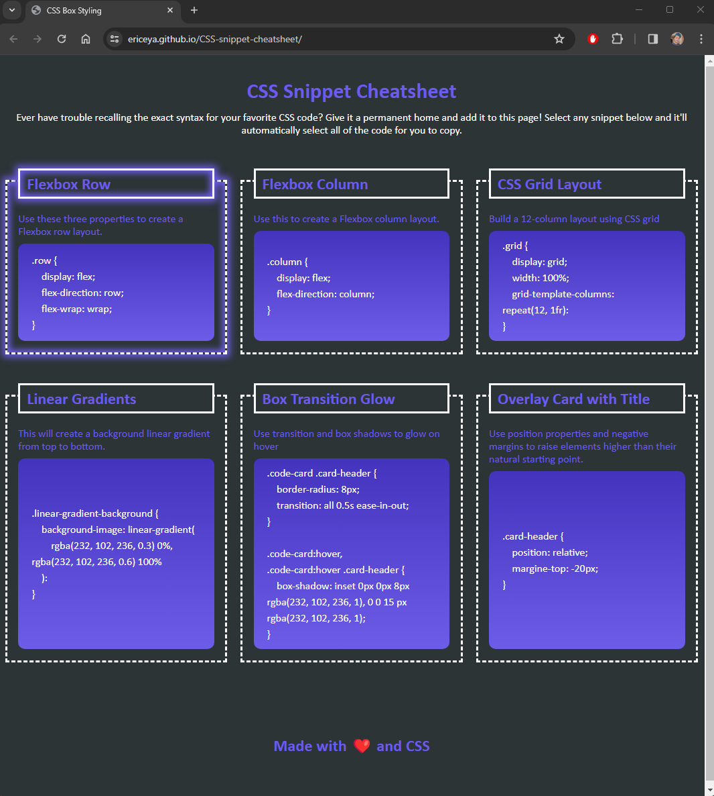

# CSS-snippet-cheatsheet

Created CSS snippet cheatsheet with styling.

## Features worked on

* Utilizing flex positioning to wrap the cards around when width gets smaller with media query and flex-wrap query
* Used `white-space: pre-wrap` to have the longer codes wrap around within the card
* Made the card glow when mouse hovers over it
* One click to the content of code snippet will select the whole code snippet
* Used linear gradient background to the code snippet

## Screenshot of deployed page

## Link to deployed page

[https://ericeya.github.io/CSS-snippet-cheatsheet](https://ericeya.github.io/CSS-snippet-cheatsheet)

